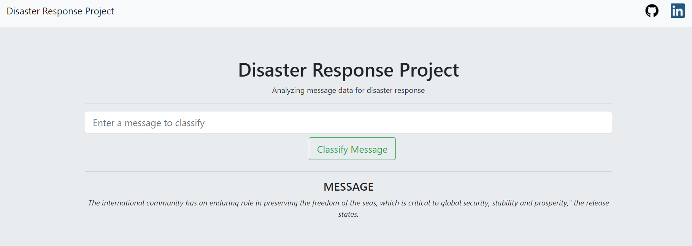
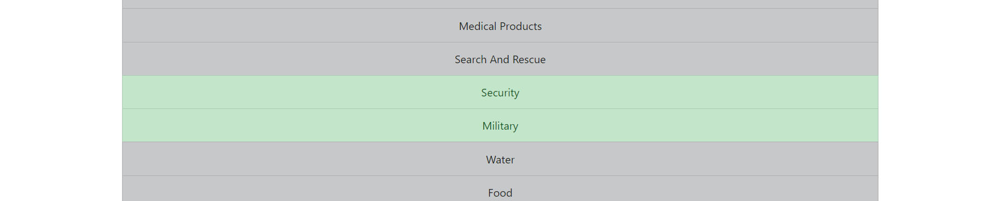
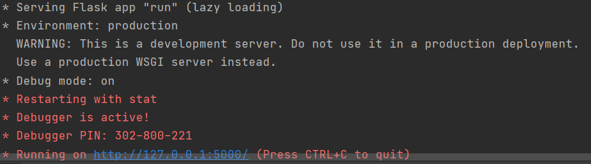
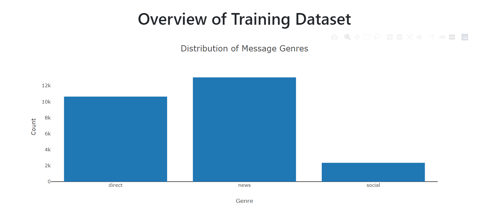
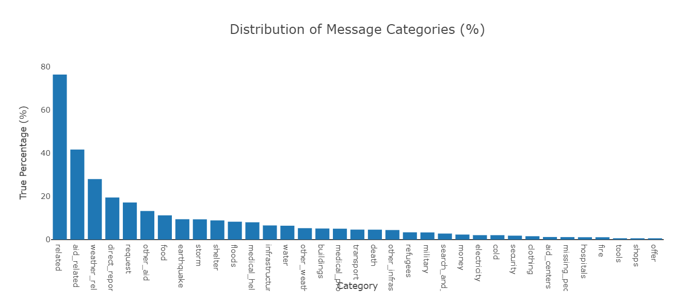
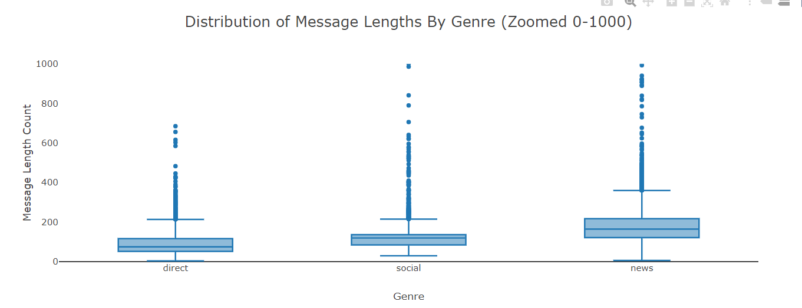

# Disaster Response Pipeline Project

## Table of Contents

1. <a href = "#Project-Overview"> Project Overview </a>
2. <a href = "#Project-Components" > Project Components </a>
3. <a href = "#Installation" > Installation </a>
4. <a href = "#Conclusion" > Conclusion </a>
5. <a href = "#File-Structure" > File Structure </a>
6. <a href = "#Requirements" > Requirements </a>
7. <a href = "#Authors" > Authors </a>
8. <a href = "#Acknowledgements" > Acknowledgements </a>

# Project Overview

In this project, i applied different data engineering techniques using <a href = "https://appen.com/"> Figure Eight </a> to build a model for an API that classifies disaster messages.

# Project Components

### ETL Pipeline

data/process_data.py clean and transform the text for Multioutput Classification

Steps:
1. Loads the messages.csv and categories.csv
2. Merge and Clean the data
3. Stores the merged and cleaned dataframe to SQlite Database

### ML Pipeline

models/train_classifier contains ML pipeline that:

1. Loads stored data 
2. Split it into train and test set
3. process the text with tex_tokenize.py file 
4. Trains the tuned model which is tuned in ML Pipeline Preparation 
5. Shows the Accuracy, Precision, Recall and F1 Scores for each category
6. Saves the model to pickle file

## Web App Deployment to Heroku

Using Flask framework, the app has deployed to the Heroku you can check <a href = "https://drp-project.herokuapp.com/">deployed app</a>

1. You can run the web app using run.py

_Text message area_

_Results area_

The app is classifies the text message into categories.

# Installation

-Codes are written in python versions 3.* and check the requirements.txt for project.

  1. Run the process_data.py: This python file provides a clean data from the disaster_categories.csv and disaster messages.csv to DisasterResponse.db
       

        python data/process_data.py data/disaster_messages.csv data/disaster_categories.csv data/DisasterResponse.db

       1. data/process_data.py: Clean the data
       2. data/disaster_messages.csv: Get the messages data 
       3. data/disaster_categories.csv: Get the categories of messages
       4. data/DisasterResponse.db: Database for storing the processed data
  
<<<<<<< HEAD
2. Run the train_classifier: Get the data from db and create ML Pipeline and save the model

      
    python models/train_classifier.py data/DisasterResponse.db models/classifier.pkl
    
    1. models/train_classifier.py: Train the model with processed data
    2. data/DisasterResponse.db: Stored Data which is provided from process_data.py
    3. models/classifier.pkl: Path of the trained model

3. Run the run.py

After clean the data and trained in train_classifier. You can run the run.py for web app

        

# Conclusion

I provided 3 graph according to training data:

- The messages are related to 3 types of genres Here is the distribution:

- First 3 Categories are: 1- related, 2- aid_related, 3- weather_related
- This data is imbalanced in most of categories so that all categories prediction accuracies are around the 90+ but Recall and Precision scores are very low. I weighted for balance the attributes in Random Forest Classifier so that ones and zeros does not have equal importance for our case

  
- Here is you can see the distribution of messages lengths distribution based on Genre. Most of messages are less than 400 letters

# File Structure
    |-- Notebooks-----------------#Notebook files for data process and model training
    |-- README.md
    |-- app
    |   |-- run.py------------------# Flask app
    |   |-- static------------------# Github and Linkedin Logos
    |   |-- templates
    |   |   |-- go.html-------------# Results page
    |   |   `-- master.html---------# Main page
    |   `-- text_tokenize.py--------# Text tokenizer 
    |-- data
    |   |-- DisasterResponse.db-----# Stored Data 
    |   |-- disaster_categories.csv-# Categories.csv
    |   |-- disaster_messages.csv---# Messages.csv
    |   `-- process_data.py---------# Data processor
    |-- img-------------------------# readme images
    |-- models
    |   |-- classifier.pkl----------# Trained model
    |   |-- text_tokenize.py--------# Text tokenizer
    |   `-- train_classifier.py-----# Classifier
    `-- requirements.txt------------# Required Python Libraries

# Requirements

All project written in Python 3.8 and requirements.txt file shows the necessary libraries

# Authors
- <a href = "https://www.linkedin.com/in/abduygur/"> A. Uygur Yiğit </a>

